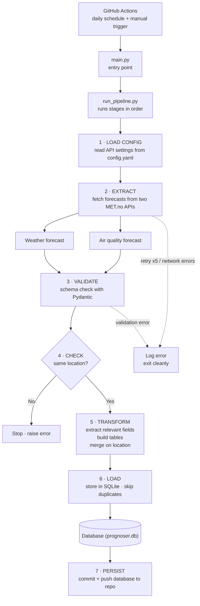
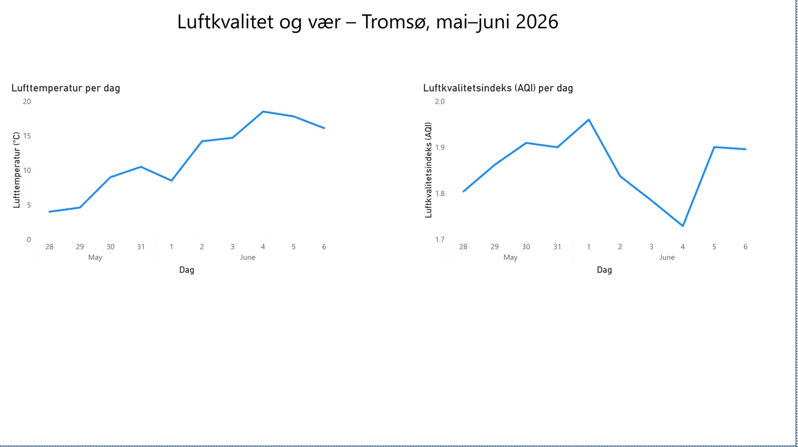

# Forurensning & Vær Pipeline / Pollution & Weather Pipeline

*(English version below / Engelsk versjon nedenfor)*

En automatisert ETL-pipeline som henter vær- og luftkvalitetsvarsler fra Meteorologisk institutt (MET.no), validerer dataene, slår sammen de to kildene og lagrer resultatet i en SQLite-database. Kjører daglig via GitHub Actions.

Prosjektet er inspirert av mitt frivillige arbeid i Røde Kors. Målet er å bygge en datapipeline som kan automatisere deler av rapporteringsarbeidet.

## Arkitektur



Pipelinen kjøres av GitHub Actions (daglig tidsplan + manuell trigger): `main.py` → `run_pipeline.py` kjører stegene i rekkefølge — last konfig, hent fra de to MET.no-APIene, valider med Pydantic, sjekk at begge kildene gjelder samme lokasjon, transformer og slå sammen, lagre til SQLite (hopp over duplikater), og commit databasen tilbake til repoet. Ved nettverks- eller valideringsfeil logges feilen og pipelinen avsluttes rent. Se arkitekturdiagrammet i den engelske seksjonen nedenfor.

## Hva den gjør

1. Laster konfigurasjon (API-URLer, headere, parametere) fra `config.yaml`
2. Henter værvarsel fra MET.no Locationforecast API
3. Henter luftkvalitetsvarsel fra MET.no Air Quality API
4. Validerer begge svar mot Pydantic-skjemaer
5. Sjekker at begge kildene gjelder samme lokasjon (koordinater innenfor 0.05° toleranse)
6. Behandler og slår sammen dataene på breddegrad/lengdegrad
7. Lagrer resultatet i en SQLite-database, hopper over duplikater

## Prosjektstruktur

```
forurensning_pipeline/
├── config/config.yaml        # API-konfig (ikke committet)
├── data/prognoser.db         # SQLite-output
├── pipelines/run_pipeline.py # kjører stegene i rekkefølge
├── src/
│   ├── data_loader.py        # API-kall med retry + feilhåndtering
│   ├── modeling.py           # Pydantic-skjemaer for begge APIer
│   ├── data_processor.py     # transformer + slå sammen
│   └── storage.py            # SQLite-opprettelse + inserts
├── tests/                    # pytest enhetstester
├── main.py                   # inngangspunkt
└── .github/workflows/        # GitHub Actions-automatisering
```

## Sentrale designvalg

- **Pydantic-validering** — begge API-svar parses til typede modeller; uventede strukturer feiler raskt med tydelige feilmeldinger i stedet for å produsere ødelagte data.
- **Retry-logikk (Tenacity)** — API-kall prøver på nytt inntil fem ganger med eksponentiell backoff for å tåle forbigående nettverksfeil.
- **Målrettet feilhåndtering** — timeouts, HTTP-feil, requestfeil og ugyldig JSON fanges opp og logges hver for seg.
- **Konsistenssjekk av koordinater** — siden de to APIene spørres separat, verifiserer pipelinen at de returnerte samme lokasjon før sammenslåing.
- **Duplikathåndtering** — en `UNIQUE(timestamp, latitude, longitude)`-constraint hindrer dupliserte rader; ved et duplikat fanges `IntegrityError` og raden hoppes over, mens enhver annen feil re-raises.

## Dashboard



Power BI-dashboard på data fra pipelinen: daglig lufttemperatur og luftkvalitetsindeks (AQI) for Tromsø, mai–juni 2026.

## Teknologier

Python · Requests · Pydantic · Tenacity · Pandas · SQLite · pytest · uv · GitHub Actions

## Datakilder

- Luftkvalitet: https://api.met.no/weatherapi/airqualityforecast/0.1/documentation
- Vær: https://api.met.no/weatherapi/locationforecast/2.0/documentation

## Kjøre lokalt

Krever Python 3.11+ og [uv](https://github.com/astral-sh/uv).

```bash
uv sync                    # installer avhengigheter
uv run python main.py      # kjør pipelinen
```

En `config/config.yaml` kreves (holder request-konfigurasjon; ikke committet).

## Tester

```bash
uv run python -m pytest tests/ -v
```

Testene dekker konfigurasjonslasting, API-svar (suksess og feil, mocket), feilhåndtering (timeouts, HTTP-feil, ugyldig JSON) og Pydantic-validering. API-kall er mocket (via `responses` / `unittest.mock`) slik at testene kjører deterministisk uten å treffe det ekte MET.no-APIet.

## Automatisering

En GitHub Actions-workflow kjører pipelinen på en daglig tidsplan (og ved manuell trigger). Runneren bygger `config.yaml` på nytt fra en repository-secret, installerer avhengigheter med uv, kjører pipelinen og committer den oppdaterte databasen tilbake til repoet.

Merk: GitHubs cron er best-effort, så faktiske kjøretider avviker fra måltidspunktet — et produksjonssystem ville brukt en dedikert scheduler for garantert timing.

## Omfang og begrensninger

Et læringsprosjekt som demonstrerer kjernemønstre innen data engineering på liten skala (én post per kjøring). Det inkluderer ikke (ennå) prosessering av store datamengder, orkestrering (Airflow/Prefect), inkrementell lasting, et sky-datavarehus, eller overvåking utover logging — dette er de naturlige neste stegene for en produksjonsversjon.

---

# Pollution & Weather Pipeline

An automated ETL pipeline that fetches weather and air-quality forecasts from the Norwegian Meteorological Institute (MET.no), validates the data, merges the two sources, and stores the result in a SQLite database. Runs daily via GitHub Actions.

The project is inspired by my volunteer work with the Norwegian Red Cross — the goal is a data pipeline that could automate parts of the reporting work.

## Architecture


## What it does

1. Loads configuration (API URLs, headers, params) from `config.yaml`
2. Fetches a weather forecast from the MET.no Locationforecast API
3. Fetches an air-quality forecast from the MET.no Air Quality API
4. Validates both responses against Pydantic schemas
5. Checks that both sources describe the same location (coordinates within 0.05° tolerance)
6. Processes and merges the data on latitude/longitude
7. Stores the result in a SQLite database, skipping duplicates

## Project structure

```
forurensning_pipeline/
├── config/config.yaml        # API config (not committed)
├── data/prognoser.db         # SQLite output
├── pipelines/run_pipeline.py # runs the stages in order
├── src/
│   ├── data_loader.py        # API requests with retry + error handling
│   ├── modeling.py           # Pydantic schemas for both APIs
│   ├── data_processor.py     # transform + merge
│   └── storage.py            # SQLite creation + inserts
├── tests/                    # pytest unit tests
├── main.py                   # entry point
└── .github/workflows/        # GitHub Actions automation
```

## Key design choices

- **Pydantic validation** — both API responses are parsed into typed models; unexpected structures fail fast with clear errors instead of producing broken data.
- **Retry logic (Tenacity)** — API calls retry up to five times with exponential backoff to survive transient network failures.
- **Targeted error handling** — timeouts, HTTP errors, request failures, and malformed JSON are caught and logged distinctly.
- **Coordinate consistency check** — since the two APIs are queried separately, the pipeline verifies they returned the same location before merging.
- **Duplicate handling** — a `UNIQUE(timestamp, latitude, longitude)` constraint prevents duplicate rows; on a duplicate insert the `IntegrityError` is caught and the row is skipped, while any other error is re-raised.

## Dashboard


Power BI dashboard built on data from the pipeline: daily air temperature and air-quality index (AQI) for Tromsø, May–June 2026.

## Tech stack

Python · Requests · Pydantic · Tenacity · Pandas · SQLite · pytest · uv · GitHub Actions

## Data sources

- Air quality: https://api.met.no/weatherapi/airqualityforecast/0.1/documentation
- Weather: https://api.met.no/weatherapi/locationforecast/2.0/documentation

## Running locally

Requires Python 3.11+ and [uv](https://github.com/astral-sh/uv).

```bash
uv sync
uv run python main.py
```

A `config/config.yaml` is required (holds request configuration; not committed).

## Tests

```bash
uv run python -m pytest tests/ -v
```

Covers config loading, mocked API success/failure responses, all handled error types, and Pydantic model validation. API calls are mocked (via the `responses` library / `unittest.mock`) so tests run deterministically without hitting the live MET.no API.

## Automation

A GitHub Actions workflow runs the pipeline on a daily schedule (and on manual trigger). The runner rebuilds `config.yaml` from a repository secret, installs dependencies with uv, runs the pipeline, and commits the updated database back to the repo.

Note: GitHub's cron is best-effort, so actual run times drift from the target — a production system would use a dedicated scheduler for guaranteed timing.

## Scope and limitations

A learning project demonstrating core data-engineering patterns on a small scale (one record per run). It does not (yet) include large-scale processing, orchestration (Airflow/Prefect), incremental loading, a cloud warehouse, or monitoring beyond logging — these are the natural next steps for a production version.
