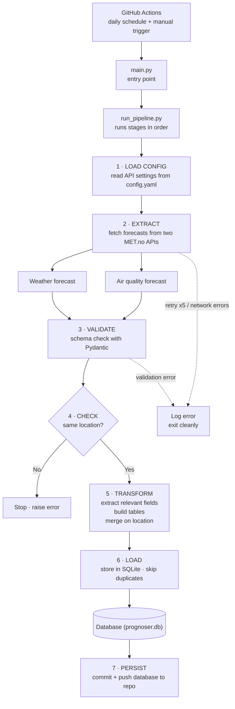

# Forurensning & Vær Pipeline

*(English version below / Engelsk versjon nedenfor)*

En automatisert ETL-pipeline som henter vær- og luftkvalitetsvarsler fra Meteorologisk institutt (MET.no), validerer dataene, slår sammen de to kildene og lagrer resultatet i en SQLite-database. Kjører daglig via GitHub Actions.

Prosjektet er inspirert av mitt frivillige arbeid i Røde Kors. Målet er å bygge en datapipeline som kan automatisere deler av rapporteringsarbeidet. Det er en del av en strukturert plan for å gå fra dataanalyse til produksjonsklare datasystemer.

## Hva den gjør

1. Laster konfigurasjon (API-URLer, headere, parametere) fra `config.yaml`
2. Henter værvarsel fra MET.no Locationforecast API
3. Henter luftkvalitetsvarsel fra MET.no Air Quality API
4. Validerer begge svar mot Pydantic-skjemaer
5. Sjekker at begge kildene gjelder samme lokasjon (koordinater innenfor 0.05° toleranse)
6. Behandler og slår sammen dataene på breddegrad/lengdegrad
7. Lagrer resultatet i en SQLite-database, hopper over duplikater

## Teknologier

Python · Requests · Pydantic · Tenacity · Pandas · SQLite · pytest · uv · GitHub Actions

## Datakilder

- Luftkvalitet: https://api.met.no/weatherapi/airqualityforecast/0.1/documentation
- Vær: https://api.met.no/weatherapi/locationforecast/2.0/documentation

## Kjøre lokalt

Krever Python 3.11+ og [uv](https://github.com/astral-sh/uv).

```bash
uv sync                    # installer avhengigheter
uv run python main.py      # kjør pipelinen
```

## Tester

```bash
uv run python -m pytest tests/ -v
```

Testene dekker konfigurasjonslasting, API-svar (suksess og feil, mocket), feilhåndtering (timeouts, HTTP-feil, ugyldig JSON) og Pydantic-validering.

## Status og videre arbeid

Dette er et læringsprosjekt som demonstrerer kjernemønstre innen data engineering på liten skala (én post per kjøring). Planlagte forbedringer: automatisert rapportering, orkestrering, og håndtering av større datamengder.

---

# Forurensning & Vær Pipeline

An automated ETL pipeline that fetches weather and air-quality forecasts from the Norwegian Meteorological Institute (MET.no), validates the data, merges the two sources, and stores the result in a SQLite database. Runs daily via GitHub Actions.

The project is inspired by my volunteer work with the Norwegian Red Cross — the goal is a data pipeline that could automate parts of the reporting work. It's part of a structured roadmap moving from data analysis toward production-ready data systems.

## Architecture



## What it does

1. Loads configuration (API URLs, headers, params) from `config.yaml`
2. Fetches a weather forecast from the MET.no Locationforecast API
3. Fetches an air-quality forecast from the MET.no Air Quality API
4. Validates both responses against Pydantic schemas
5. Checks that both sources describe the same location (coordinates within 0.05° tolerance)
6. Processes and merges the data on latitude/longitude
7. Stores the result in a SQLite database, skipping duplicates

## Project structure

```
forurensning_pipeline/
├── config/config.yaml        # API config (not committed)
├── data/prognoser.db         # SQLite output
├── pipelines/run_pipeline.py # runs the stages in order
├── src/
│   ├── data_loader.py        # API requests with retry + error handling
│   ├── modeling.py           # Pydantic schemas for both APIs
│   ├── data_processor.py     # transform + merge
│   └── storage.py            # SQLite creation + inserts
├── tests/                    # pytest unit tests
├── main.py                   # entry point
└── .github/workflows/        # GitHub Actions automation
```

## Key design choices

- **Pydantic validation** — both API responses are parsed into typed models; unexpected structures fail fast with clear errors instead of producing broken data.
- **Retry logic (Tenacity)** — API calls retry up to five times with exponential backoff to survive transient network failures.
- **Targeted error handling** — timeouts, HTTP errors, request failures, and malformed JSON are caught and logged distinctly.
- **Coordinate consistency check** — since the two APIs are queried separately, the pipeline verifies they returned the same location before merging.

## Tech stack

Python · Requests · Pydantic · Tenacity · Pandas · SQLite · pytest · uv · GitHub Actions

## Data sources

- Air quality: https://api.met.no/weatherapi/airqualityforecast/0.1/documentation
- Weather: https://api.met.no/weatherapi/locationforecast/2.0/documentation

## Running locally

Requires Python 3.11+ and [uv](https://github.com/astral-sh/uv).

```bash
uv sync
uv run python main.py
```

A `config/config.yaml` is required (holds request configuration; not committed).

## Tests

```bash
uv run python -m pytest tests/ -v
```

Covers config loading, mocked API success/failure responses, all handled error types, and Pydantic model validation.

## Automation

A GitHub Actions workflow runs the pipeline on a daily schedule (and on manual trigger). The runner rebuilds `config.yaml` from a repository secret, installs dependencies with uv, runs the pipeline, and commits the updated database back to the repo.

Note: GitHub's cron is best-effort, so actual run times drift from the target — a production system would use a dedicated scheduler for guaranteed timing.

## Scope and limitations

A learning project demonstrating core data-engineering patterns on a small scale. It does not (yet) include large-scale processing, orchestration (Airflow/Prefect), incremental loading, a cloud warehouse, or monitoring beyond logging — these are the natural next steps for a production version.
